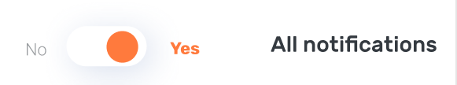
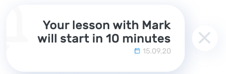
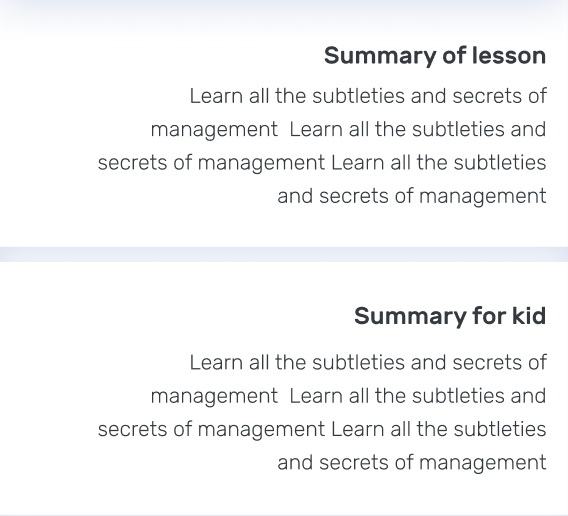
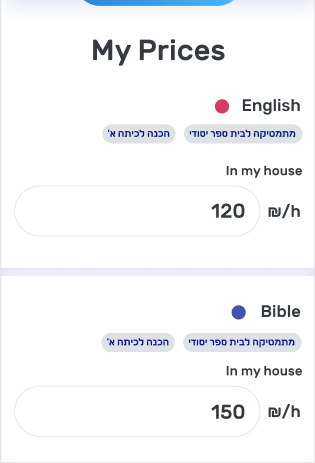
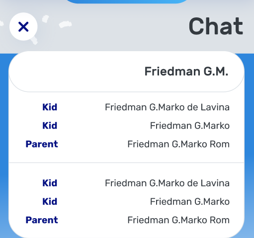
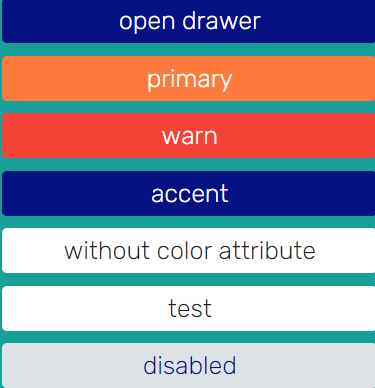
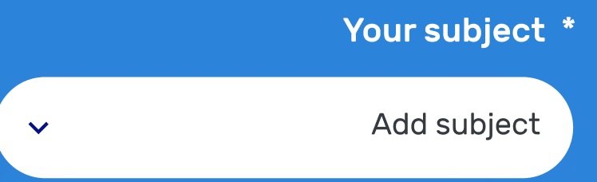
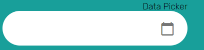

Все компоненты должны 
содержать в себе enum **changeDetection**, 
со значением **ChangeDetectionStrategy.OnPush**

## StarCardComponent (#25 notification from kid)
### Тэг: 
```html
<app-star-card></app-star-card>
```
### Компонент
* @Input() card: IStarCard

### Реализация
Для реализации 
необходимо передавать в
атрибут **[card]** объект с интерфейосм:
```ts
export interface IStarCard {
  text: string;
  countStars: number;
}
```
### Screenshot


## NotificationSettingComponent (#22 notification setting)
### Тэг: 
```html
<app-notification-setting></app-notification-setting>
```
### Компонент
* @Input() setting: INotificationSetting

### Реализация
Для реализации 
необходимо передавать в
атрибут **[setting]** объект с интерфейосм:
```ts
export interface INotificationSetting {
  text: string;
  select?: ISelect;
}
```
### Screenshot


## NotificationListComponent (#23 notification all)
### Тэг: 
```html
<app-notification-list></app-notification-list>
```
### Компонент
* @Input() list: INotificationList

### Реализация
Для реализации 
необходимо передавать в
атрибут **[list]** объект с интерфейосм:
```ts
export interface INotificationList {
  text: string;
  date: string;
  phoneNumber?: string;
  isRequiresConfirmation?: boolean;
}
```
### Screenshot


## ScheduleCardComponent (#11 schedule)
### Тэг: 
```html
<app-schedule-card></app-schedule-card>
```
### Компонент
* @Input() card: IScheduleCard

### Реализация
Для реализации 
необходимо передавать в
атрибут **[card]** объект с интерфейосм:
```ts
export interface IScheduleCard {
  name: string;        
  date: string;
  dotColor: NamesColor;              
  subject?: string;
}
```
### Screenshot


## LessonCardComponent (#18 lesson card for student...)
### Тэг: 
```html
<app-lesson-card></app-lesson-card>
```
### Компонент
* @Input() card: ILessonCard

### Реализация
Для реализации 
необходимо передавать в
атрибут **[card]** объект с интерфейосм:
```ts
export interface ILessonCard {
  kidText: string;
  lessonText: string;
  parentText: string;
  nextLessonText: string;
  homeworkTastText: string;  
}
```
### Screenshot


## PriceCardsComponent (#09 Prices)
### Тэг: 
```html
<app-price-cards></app-price-cards>
```
### Компонент
* @Input() cards: IPriceCard[]

### Реализация
Для реализации 
необходимо передавать в
атрибут **[cards]** объект с интерфейосм:
```ts
interface IPriceInput {
  label: 'In my house' | 'At student house';
}

export interface IPriceCard {
  subject: string;
  subcategories: string[];
  inputs: IPriceInput[];
}
```
### Screenshot


## ChatOverlayComponent (#41 Chat)
### Тэг: 
```html
<app-chat-overlay></app-chat-overlay>
```
### Компонент
* @Input() chat: IChatOverlay[]

### Реализация
Для реализации 
необходимо передавать в
атрибут **[chat]** объект с интерфейосм:
```ts
interface IChatMessage {
  name: string;
  message: string;
}

export interface IChatOverlay {
  kid: string[];
  parent: string[];
}
```
### Screenshot


## ChatOverlayComponent (#24 Chat)
### Тэг: 
```html
<app-chat-overlay></app-chat-overlay>
```
### Компонент
* @Input() chat: IChat

### Реализация
Для реализации 
необходимо передавать в
атрибут **[chat]** объект с интерфейосм:
```ts
export interface IChat {
  message: string;    
  img: string;
  readed: boolean;
  date: string;
  isMyMesssage: boolean;
}
```
### Screenshot


## PaymentCardComponent (#17 payment)
### Тэг: 
```html
<app-payment-card></app-payment-card>
```
### Компонент
* @Input() img: string

### Реализация
Для реализации 
необходимо передавать в
атрибут **[img]** объект с интерфейосм:
### Screenshot


## Checkbox
### Тэг: 
```html
<mat-checkbox></mat-checkbox>
```
### Директивы
* color

### Реализация
Angular Material Checkbox, для реализации необходим import
```ts
import {MatCheckboxModule} from '@angular/material/checkbox';
```

## Button
### Тэг: 
```html
<button></button>
```
### Директивы
* mat-button
* mat-flat-button
* mat-raised-button
* mat-stroked-button
* color

### Реализация
Angular Material Button, для реализации необходим import
```ts
import {MatButtonModule} from '@angular/material/button';
```
Для сменя цветовой палитры необходимо 
перейти в файл assets/styles/_var.scss
* $mat-primary - оранжевый цвет
* $mat-accent - синий цвет
* $mat-warn - красный цвет
* не передавая атрибут color - белый цвет

$button-size - font-size кнопки

### Screenshot


## Checkbox
### Тэг: 
```html
<mat-checkbox></mat-checkbox>
```
### Директивы
* color

### Переменные
* $checkbox-height: высота checkbox'a;
* $checkbox-width: ширина checkbox'a;

### Реализация
Angular Material Checkbox, для реализации необходим import
```ts
import {MatCheckboxModule} from '@angular/material/checkbox';
```

### Screenshot


## Select
### Тэг: 
```html
<app-select></app-select>
```
### Компонент
* @Input() select: ISelect
### Реализация
Для реализации 
необходимо передавать в
атрибут **[select]** объект с интерфейосм:
```ts
interface ISelectOptions {
  value: string;
}

export interface ISelect {
  title: string;
  options: ISelectOptions[];
}
```
сделать import, т.к. компонент angular material
```ts
import {MatSelectModule} from '@angular/material/select';
```

### Screenshot


## Dot
### Тэг: 
```html
<div></div>
```
### Директивы
* appDot
* color

### Переменные
* $dot-height: высота dot
* $dot-width: ширина dot
* $dot-border-radius: border-radius dot

### Реализация
Для работоспособности компонента, необходимо в тег **div** записать два attributes:
* appDot
* color (primary, warn, pink, gradient, accent, green)
```ts
import {MatButtonModule} from '@angular/material/button';
```

### Screenshot


## Datepicker
### Тэг: 
```html
<app-datepicker></app-datepicker>
```

### Реализация
Для работоспособности компонента необходимо сделать импорт модуля
```ts
import {MatButtonModule} from '@angular/material/button';
```



