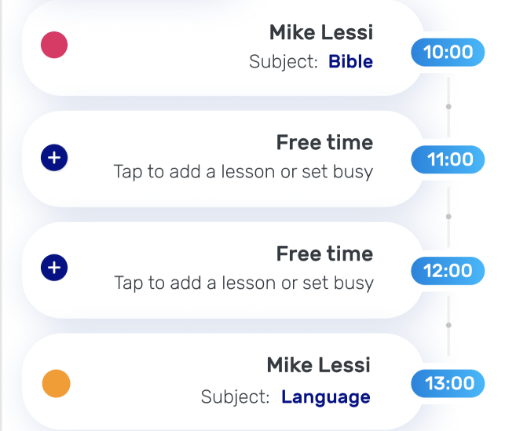
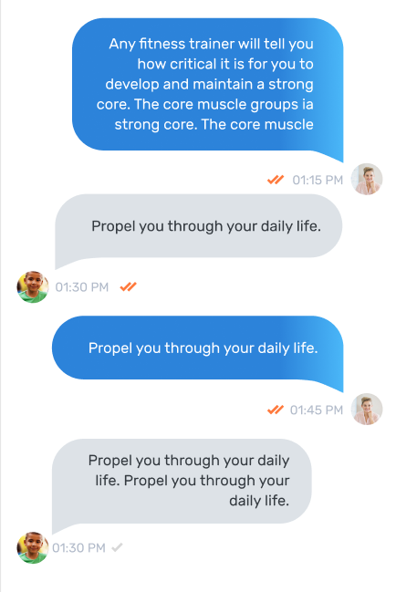

Все компоненты должны 
содержать в себе enum **changeDetection**, 
со значением **ChangeDetectionStrategy.OnPush**

## NotificationCardComponent (#25 notification from kid)
### Тэг: 
```html
<app-notification-card></app-notification-card>
```
### Компонент
* @Input() card: INotificationCard

### Реализация
Для реализации 
необходимо передавать в
атрибут **[card]** объект с интерфейосм:
```ts
export interface INotificationCard {
  text: string;
  countStars: number;
}
```
### Screenshot


## NotificationSettingComponent (#22 notification setting)
### Тэг: 
```html
<app-notification-setting></app-notification-setting>
```
### Компонент
* @Input() setting: INotificationSetting

### Реализация
Для реализации 
необходимо передавать в
атрибут **[setting]** объект с интерфейосм:
```ts
export interface INotificationSetting {
  text: string;
  select?: ISelect;
}
```
### Screenshot


## NotificationListComponent (#23 notification all)
### Тэг: 
```html
<app-notification-list></app-notification-list>
```
### Компонент
* @Input() list: INotificationSetting[]

### Реализация
Для реализации 
необходимо передавать в
атрибут **[list]** объект с интерфейосм:
```ts
export interface INotificationList {
  text: string;
  date: string;
}
```
### Screenshot


## ScheduleCardComponent (#11 schedule)
### Тэг: 
```html
<app-schedule-card></app-schedule-card>
```
### Компонент
* @Input() card: IScheduleCard

### Реализация
Для реализации 
необходимо передавать в
атрибут **[card]** объект с интерфейосм:
```ts
export interface IScheduleCard {
  name: string;        
  date: string;
  dotColor: NamesColor;              
  subject?: string;
}
```
### Screenshot


## ScheduleCardComponent (#11 schedule)
### Тэг: 
```html
<app-schedule-card></app-schedule-card>
```
### Компонент
* @Input() card: IScheduleCard

### Реализация
Для реализации 
необходимо передавать в
атрибут **[card]** объект с интерфейосм:
```ts
export interface IScheduleCard {
  name: string;        
  date: string;
  dotColor: NamesColor;              
  subject?: string;
}
```
### Screenshot


## LessonCardComponent (#18 lesson card for student...)
### Тэг: 
```html
<app-lesson-card></app-lesson-card>
```
### Компонент
* @Input() card: ILessonCard

### Реализация
Для реализации 
необходимо передавать в
атрибут **[card]** объект с интерфейосм:
```ts
export interface ILessonCard {
  kidText: string;
  lessonText: string;
  parentText: string;
  nextLessonText: string;
  homeworkTastText: string;  
}
```
### Screenshot


## PriceCardsComponent (#09 Prices)
### Тэг: 
```html
<app-price-cards></app-price-cards>
```
### Компонент
* @Input() cards: IPriceCard[]

### Реализация
Для реализации 
необходимо передавать в
атрибут **[cards]** объект с интерфейосм:
```ts
interface IPriceInput {
  label: 'In my house' | 'At student house';
}

export interface IPriceCard {
  subject: string;
  subcategories: string[];
  inputs: IPriceInput[];
}
```
### Screenshot


## ChatOverlayComponent (#41 Chat)
### Тэг: 
```html
<app-chat-overlay></app-chat-overlay>
```
### Компонент
* @Input() chat: IChatOverlay[]

### Реализация
Для реализации 
необходимо передавать в
атрибут **[chat]** объект с интерфейосм:
```ts
export interface IChatOverlay {
  name: string;
  rule: string;
  message: string;
}
```
### Screenshot


## ChatOverlayComponent (#24 Chat)
### Тэг: 
```html
<app-chat-overlay></app-chat-overlay>
```
### Компонент
* @Input() chat: IChat

### Реализация
Для реализации 
необходимо передавать в
атрибут **[chat]** объект с интерфейосм:
```ts
export interface IChat {
  message: string;    
  img: string;
  readed: boolean;
}
```
### Screenshot


## PaymentCardComponent (#17 payment)
### Тэг: 
```html
<app-payment-card></app-payment-card>
```
### Компонент
* @Input() img: string

### Реализация
Для реализации 
необходимо передавать в
атрибут **[img]** объект с интерфейосм:
### Screenshot

