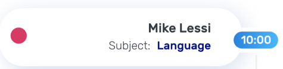
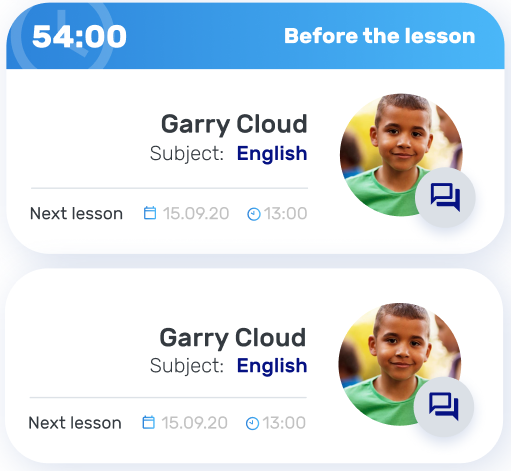

## BtnCorner
```html
<button mat-flat-button disabled color="accent" class="corner">
  <gen-icon name=""></gen-icon>
</button>
<button mat-flat-button class="corner" color="primary"></button>
<button mat-flat-button disabled class="corner" color="primary"></button>
```


## BtnBottom
```html
<button mat-flat-button class="bottom" color="primary"></button>
```


## Icon
```html
<gen-icon></gen-icon>
```


## Dot
```html
<gen-dot></gen-dot>
```


## Datepicker
```html
<gen-datepicker></gen-datepicker>
```


## Select
```html
<gen-select></gen-select>
```


## Validation
### HTML
```html
<gen-validation></gen-validation>
```


## CardEmoji
### HTML
```html
<gen-card-emoji></gen-card-emoji>
```


## CardSchedule
### HTML
```html
<gen-card-schedule></gen-card-schedule>
```


## BtnFapMenu
### HTML
```html
<gen-fap-menu></gen-fap-menu>
```


## CardTitle
### HTML
```html
<gen-card-title></gen-card-title>
```


## CardEmpty
### HTML
```html
<gen-card-empty></gen-card-empty>
```


## CalendarWeek
### HTML
```html
<gen-calendar-week></gen-calendar-week>
```


## Textarea
### HTML
```html
<gen-textarea></gen-textarea>
```


## CardLesson
### HTML
```html
<gen-card-lesson></gen-card-lesson>
```


[prev list](https://github.com/DmitryRoar/components-for-project/blob/master/COMPONENTS.md)

gen component
```html
<gen-icon></gen-icon>
<gen-dot></gen-dot>
<gen-textarea></gen-textarea>
<gen-datepicker></gen-datepicker>
<gen-select></gen-select>
<gen-validation></gen-validation>
<gen-card-emoji></gen-card-emoji>
<gen-card-schedule></gen-card-schedule>
<gen-card-title></gen-card-title>
<gen-card-lesson></gen-card-lesson>
<gen-fap-menu></gen-fap-menu>
<gen-card-empty></gen-card-empty>
<gen-calendar-week></gen-calendar-week>
```
