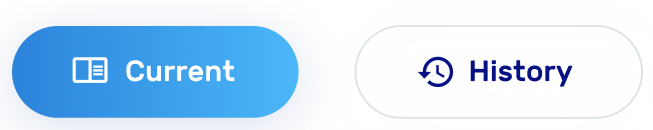

## Button
```html
<button></button>
```


## Img
```html
<gen-img></gen-img>
```


## Dot
```html
<gen-dot></gen-dot>
```


## ImgButton
```html
<gen-img-button></gen-img-button>
```


## InputBd
```html
<gen-input-bd></gen-input-bd>
```


## SelectTimeHours
```html
<gen-select-time-hours></gen-select-time-hours>
```


## ValidationAlert
### HTML
```html
<gen-validation-alert></gen-validation-alert>
```


## Emoji
### HTML
```html
<gen-emoji></gen-emoji>
```


## PhotoButtonComponent
### HTML
```html
<gen-photo-button></gen-photo-button>
```


## SubjectCard
### HTML
```html
<gen-subject-card></gen-subject-card>
```


## FapButton
### HTML
```html
<gen-fap-button-menu></gen-fap-button-menu>
```


## CardHeader
### HTML
```html
<gen-card-header></gen-card-header>
```


## ImgEmpty
### HTML
```html
<gen-img-empty></gen-img-empty>
```


## WeekCalendar
### HTML
```html
<gen-week-calendar></gen-week-calendar>
```


## Textarea
### HTML
```html
<gen-textarea></gen-textarea>
```


## LessonStudentCard
### HTML
```html
<gen-lesson-student-card></gen-lesson-student-card>
```


## BtnRound
### HTML
```html
<gen-btn-round></gen-btn-round>
```


## SelectStudent
### HTML
```html
<gen-select-student></gen-select-student>
```


## SelectSubject
### HTML
```html
<gen-select-subject></gen-select-subject>
```


[more](COMPONENTS.md)

```html
<gen-select-subject></gen-select-subject>
<gen-select-student></gen-select-student>
<gen-btn-round></gen-btn-round>
<gen-lesson-student-card></gen-lesson-student-card>
<gen-textarea></gen-textarea>
<gen-week-calendar></gen-week-calendar>
<gen-img-empty></gen-img-empty>
<gen-card-header></gen-card-header>
<gen-fap-button-menu></gen-fap-button-menu>
<gen-subject-card></gen-subject-card>
<gen-photo-button></gen-photo-button>
<gen-emoji></gen-emoji>
<gen-validation-alert></gen-validation-alert>
<gen-select-time-hours></gen-select-time-hours>
<gen-input-bd></gen-input-bd>
<gen-img-button></gen-img-button>
<gen-dot></gen-dot>
<gen-img></gen-img>
<button></button>
```
