## BtnCorner
```html
<button mat-flat-button disabled color="accent" class="corner">
  <gen-icon name=""></gen-icon>
</button>
<button mat-flat-button class="corner" color="primary"></button>
<button mat-flat-button disabled class="corner" color="primary"></button>
```

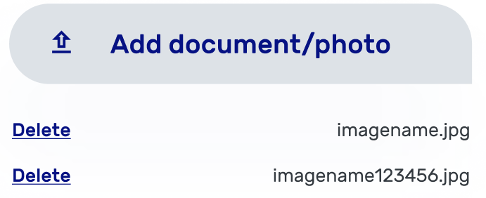

## BtnBottom
```html
<button mat-flat-button class="bottom" color="primary"></button>
```


## Icon
```html
<gen-icon></gen-icon>
```


## Img
```html
<gen-img></gen-img>
```


## Dot
```html
<gen-dot></gen-dot>
```


## Datepicker
```html
<gen-datepicker></gen-datepicker>
```
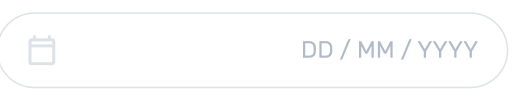

## Select
```html
<gen-select></gen-select>
```
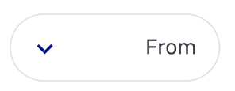
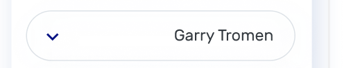
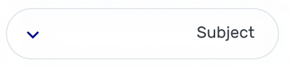
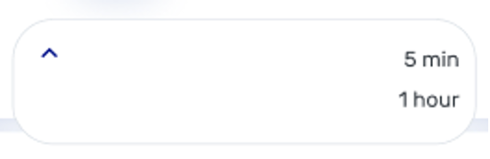

## Card
### HTML
```html
<gen-card></gen-card>
```


## CalendarWeek
### HTML
```html
<gen-calendar-week></gen-calendar-week>
```
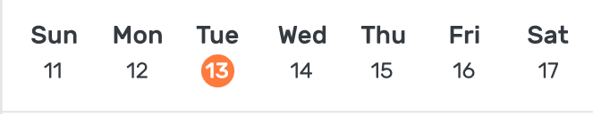

## Textarea
### HTML
```html
<gen-textarea></gen-textarea>
```
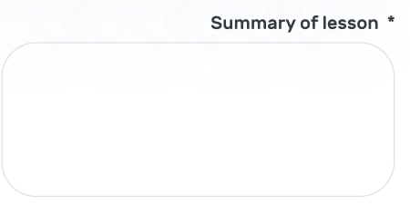

## BtnFab
### HTML
```html
<button mat-fab class="reverse">
  <gen-icon></gen-icon>
</button>
```


## Input
### HTML
```html
<gen-input></gen-input>
```


## SelectMultiple
### HTML
```html
<gen-select-multiple></gen-select-multiple>
```


## SelectMultiple
### HTML
```html
<gen-avatar></gen-avatar>
```


## Chip
### HTML
```html
<gen-chip></gen-chip>
```


## InputSearch
### HTML
```html
<gen-input-search></gen-input-search>
```
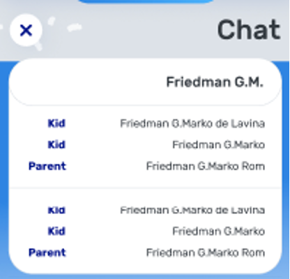

## BtnDot
### HTML
```html
<gen-btn-dot></gen-btn-dot>
```
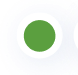

## Radiobutton
### HTML
```html
<gen-radio-button></gen-radio-button>
```
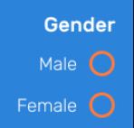

## Checkbox
### HTML
```html
<gen-checkbox></gen-checkbox>
```
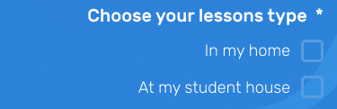

## InputLocation
### HTML
```html
<gen-input-location></gen-input-location>
```
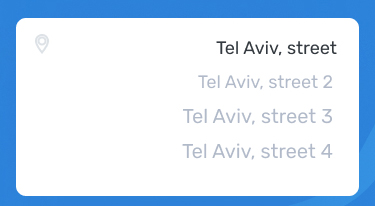

## TrackbarDistance
### HTML
```html
<gen-trackbar-distance></gen-trackbar-distance>
```
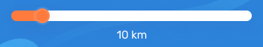

## Button
### Цвета
* primary - оранжевый цвет
* accent - темно-синий цвет
* warn - красный цвет
* accent-gradient - темно-синий градиент
### Классы
* corner - закругление обводки на нижнем правом углу ставится на 0
* bottom - закругление обводки по нижнему левому и правому углу 
* reverse - задний цвет ставится на белый и цвет текста устанавливается на выбранный из color

```html
<gen-icon></gen-icon>
<gen-img></gen-img>
<gen-dot></gen-dot>
<gen-input></gen-input>
<gen-textarea></gen-textarea>
<gen-datepicker></gen-datepicker>
<gen-select></gen-select>
<gen-select-multiple></gen-select-multiple>
<gen-card></gen-card>
<gen-avatar></gen-avatar>
<gen-radio-button></gen-radio-button>
<gen-checkbox></gen-checkbox>
<gen-input-location></gen-input-location>
<gen-trackbar-distance></gen-trackbar-distance>
<gen-chip></gen-chip>
<gen-calendar-week></gen-calendar-week>
<gen-input-search></gen-input-search>
<gen-btn-dot></gen-btn-dot>
```

## TextList
### Цвета: 
* #343A40
* #000
* #061283
* #BEDDFC
* #1E2022
* #B1BAC9
* #c2c2c2
* #FF7A3D
* #fff
## Размеры:
* 45px
* 20px
* 14px
* 35px
* 25px
* 12px
* 18px
* 16px
* 15px
* 30px
## Толщина:
* 500
* 300
* 400
* 700
## Положение: 
* center
* right

## Colors
purple #061283 #061283
orange #FF7A3D #FF7A3D
white #FFFFFF #FFFFFF
white-gray #FFFFFF #DDE2E7
blue-gradient linear-gradient(90deg, #2C83DA 0%, #4AB7F8 100%)
Sizes height: auto; width:
xxl 40px
xl 38px
l 30px
m 26px
s 20px
xs 16px
xxs 11px
