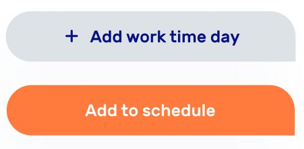

## BtnCornerEdges
```html
<gen-btn-corner-edges></gen-btn-corner-edges>
```


## BtnCornerModal
```html
<gen-btn-modal></gen-btn-modal>
```


## Img
```html
<gen-img></gen-img>
```


## Dot
```html
<gen-dot></gen-dot>
```


## InputBd
```html
<gen-input-bd></gen-input-bd>
```


## SelectTimeHours
```html
<gen-select-time-hours></gen-select-time-hours>
```


## Validation
### HTML
```html
<gen-validation></gen-validation>
```


## Emoji
### HTML
```html
<gen-emoji></gen-emoji>
```


## CardEmoji
### HTML
```html
<gen-card-emoji></gen-card-emoji>
```


## BtnNext
### HTML
```html
<gen-btn-next></gen-btn-next>
```


## DocLoadList
### HTML
```html
<gen-doc-load-list></gen-doc-load-list>
```


## CardSchedule
### HTML
```html
<gen-card-schedule></gen-card-schedule>
```


## BtnFapMenu
### HTML
```html
<gen-btn-fap-menu></gen-btn-fap-menu>
```


## CardLessonTitle
### HTML
```html
<gen-card-lesson-title></gen-card-lesson-title>
```


## Card
### HTML
```html
<gen-card></gen-card>
```


## CalendarWeek
### HTML
```html
<gen-calendar-week></gen-calendar-week>
```


## Textarea
### HTML
```html
<gen-textarea></gen-textarea>
```


## CardLesson
### HTML
```html
<gen-card-lesson></gen-card-lesson>
```


## BtnRound
### HTML
```html
<gen-btn-round></gen-btn-round>
```


## SelectStudent
### HTML
```html
<gen-select-student></gen-select-student>
```


## SelectSubject
### HTML
```html
<gen-select-subject></gen-select-subject>
```


## CardHomework
### HTML
```html
<gen-card-homework></gen-card-homework>
```


## BtnFab
### HTML
```html
<gen-btn-fab></gen-btn-fab>
```


## BtnIcon
### HTML
```html
<gen-btn-icon></gen-btn-icon>
```


[more](COMPONENTS.md)

```html
<gen-btn-corner-edges></gen-btn-corner-edges>
<gen-btn-modal></gen-btn-modal>
<gen-btn-fap></gen-btn-fap>
<gen-btn-next></gen-btn-next>
<gen-btn-fap-menu></gen-btn-fap-menu>
<gen-btn-round></gen-btn-round>
<gen-btn-icon></gen-btn-icon>
<gen-select-time-hours></gen-select-time-hours>
<gen-select-student></gen-select-student>
<gen-select-subject></gen-select-subject>
<gen-card-lesson></gen-card-lesson>
<gen-card-homework></gen-card-homework>
<gen-card></gen-card>
<gen-card-lesson-title></gen-card-lesson-title>
<gen-card-schedule></gen-card-schedule>
<gen-textarea></gen-textarea>
<gen-img></gen-img>
<gen-dot></gen-dot>
<gen-input-bd></gen-input-bd>
<gen-validation></gen-validation>
<gen-emoji></gen-emoji>
<gen-card-emoji></gen-card-emoji>
<gen-doc-load-list></gen-doc-load-list>
<gen-calendar-week></gen-calendar-week>
```
