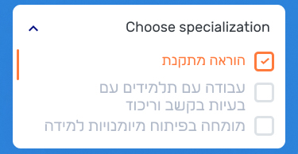

## TrackbarDistance
### Выполняет Alexander
### HTML
```html
<gen-trackbar-distance></gen-trackbar-distance>
```
### Реализация
Принимает минимальное, максимальное и значение шага. Дополнительно принимает метку, которая будет отображаться возле текущего выбранного значения. <br>


## Icon
### Выполняет Alexander
### HTML
```html
<gen-icon></gen-icon>
```
### Реализация
Принимает название иконки, и название размера: 
* xxl 
* xl
* l
* m 
* s
* xs
* xxs. <br>
### Цвета
* purple #061283 
* orange #FF7A3D
* white #FFFFFF
* white-gray #DDE2E7
* blue-gradient linear-gradient(90deg, #2C83DA 0%, #4AB7F8 100%)
### Размеры height: auto; width:
* xxl 40px
* xl 38px
* l 30px
* m 26px
* s 20px
* xs 16px
* xxs 11px


## Select
### Выполняет Alexander
### HTML
```html
<gen-select></gen-select>
```
### Реализация
Принимает массив опций для выбора, запрет на пустое поле (если выбор не задан, то выбранным станет первый элемент в списке опций).
Имеет исходящее событие выбора опции. <br>


## CalendarWeek
### Выполняет Alexander
### HTML
```html
<gen-calendar-week></gen-calendar-week>
```
### Реализация
Компонент сам генерирует дни недели в соответствии текущей даты.
Имеет исходящее событие выбора даты.
На вход принимает выбранную дату. <br>


## Avatar
### Выполняет Alexander
### HTML
```html
<gen-avatar></gen-avatar>
```
### Реализация
Принимать путь к изображению и размер:
* xxl 215x215
* xl 85x85
* l 55x55
* m 30x30. <br>


## Chip
### Выполняет Alexander
### HTML
```html
<gen-chip></gen-chip>
```
### Реализация
Принимает цвет и текст. Текст принимать через ng-content или входящий параметр. <br>


## InputSearch
### Выполняет Alexander
### HTML
```html
<gen-input-search></gen-input-search>
```
### Реализация
При активации данного компонента используя overlay отображать компонент с фоном на всю страницу ниже шапки.
Компонент отображает поле ввода, во время ввода текста излучать событие изменение текста. Принимать список опций для отображения вариантов выбора под элементом ввода. После выбора одного из вариантов излучить события выбора опции и прекратить отображение компонента. <br>


## BtnCorner
### Выполняет Dmitry
### HTML
```html
<button mat-flat-button disabled color="accent" class="corner">
  <gen-icon name=""></gen-icon>
</button>
<button mat-flat-button class="corner" color="primary"></button>
<button mat-flat-button disabled class="corner" color="primary"></button>
```
### Реализация
* в элемент передавать класс **corner** 
* в качестве атрибута передавать **mat-fab** 
* Material Angular, для реализации необходим импорт нужного модуля
```ts
import {MatButtonModule} from '@angular/material/button';
```


## BtnBottom
### Выполняет Dmitry
### HTML
```html
<button mat-flat-button class="bottom" color="primary"></button>
```
### Реализация
* в элемент передавать класс **bottom**
* в качестве атрибута передавать **mat-flat-button** 
* Material Angular, для реализации необходим импорт нужного модуля
```ts
import {MatButtonModule} from '@angular/material/button';
```


## BtnFab
### Выполняет Dmitry
### HTML
```html
<button mat-fab class="reverse">
  <gen-icon></gen-icon>
</button>
```
### Реализация
* в элемент передавать класс **reverse**
* в качестве атрибута передавать **mat-fab**
* Material Angular, для реализации необходим импорт нужного модуля
```ts
import {MatButtonModule} from '@angular/material/button';
```


## BtnDot
### Выполняет Dmitry
### HTML
```html
<gen-btn-dot></gen-btn-dot>
```
### Реализация
Material Angular, для реализации необходим импорт нужного модуля
```ts
import {MatButtonModule} from '@angular/material/button';
```


## Dot
### Выполняет Dmitry
### HTML
```html
<gen-dot></gen-dot>
```
### Реализация
используется директива color:
* primary 
* warn
* pink
* gradient
* accent
* green <br>


## Datepicker
### Выполняет Dmitry
### HTML
```html
<gen-datepicker></gen-datepicker>
```
### Реализация
Material Angular, для реализации необходим импорт нужного модуля
```ts
import {MatDatepickerModule} from '@angular/material/datepicker';
```


## Textarea
### Выполняет Dmitry
### HTML
```html
<gen-textarea></gen-textarea>
```
### Реализация
На вход принимает объект **data**


## Checkbox
### Выполняет Dmitry
### HTML
```html
<gen-checkbox></gen-checkbox>
```
### Реализация
Material Angular, для реализации необходим импорт нужного модуля
```ts
import {MatCheckboxModule} from '@angular/material/checkbox';
```


## InputLocation
### Выполняет Dmitry
### HTML
```html
<gen-input-location></gen-input-location>
```
### Реализация
При вводе пользователем адреса, подтягивается с сервера предложенные результаты

## Button
### Выполняет Dmitry
### Цвета
* primary - оранжевый цвет
* accent - темно-синий цвет
* warn - красный цвет
* accent-gradient - темно-синий градиент
### Классы
* corner - закругление обводки на нижнем правом углу ставится на 0
* bottom - закругление обводки по нижнему левому и правому углу 
* reverse - задний цвет ставится на белый и цвет текста устанавливается на выбранный из color

## Img
### Выполняет Vladimir
### HTML
```html
<gen-img></gen-img>
```


## Card
### Выполняет Vladimir
### HTML
```html
<gen-card></gen-card>
```


## Input
### Выполняет Vladimir
### HTML
```html
<gen-input></gen-input>
```


## SelectMultiple
### Выполняет Vladimir
### HTML
```html
<gen-select-multiple></gen-select-multiple>
```


## Radiobutton
### Выполняет Vladimir
### HTML
```html
<gen-radio-button></gen-radio-button>
```


## ChatBubble
### Выполняет Vladimir
### HTML
```html
<gen-chat-bubble></gen-chat-bubble>
```


## TextList
### Цвета: 
<ul>
<li> #343A40 </li>
<li> #000 </li>
<li> #061283 </li>
<li> #BEDDFC </li>
<li> #1E2022 </li>
<li> #B1BAC9 </li>
<li> #c2c2c2 </li>
<li> #FF7A3D </li>
<li> #fff </li>
</ul>

### Размеры:
<ul>
<li> 45px </li>
<li> 20px </li>
<li> 14px </li>
<li> 35px </li>
<li> 25px </li>
<li> 12px </li>
<li> 18px </li>
<li> 16px </li>
<li> 15px </li>
<li> 30px </li>
</ul>

### Толщина:
<ul>
<li> 500 </li>
<li> 300 </li>
<li> 400 </li>
<li> 700 </li>
</ul>

### Положение: 
* center
* right

## Список UI KIT
```html
<gen-icon></gen-icon>
<gen-img></gen-img>
<gen-dot></gen-dot>
<gen-input></gen-input>
<gen-textarea></gen-textarea>
<gen-datepicker></gen-datepicker>
<gen-select></gen-select>
<gen-select-multiple></gen-select-multiple>
<gen-card></gen-card>
<gen-avatar></gen-avatar>
<gen-radio-button></gen-radio-button>
<gen-checkbox></gen-checkbox>
<gen-input-location></gen-input-location>
<gen-trackbar-distance></gen-trackbar-distance>
<gen-chat-bubble></gen-chat-bubble>
<gen-chip></gen-chip>
<gen-calendar-week></gen-calendar-week>
<gen-input-search></gen-input-search>
<gen-btn-dot></gen-btn-dot>
```

## Выполняет Alexander
```html
<gen-icon></gen-icon>
<gen-select></gen-select>
<gen-calendar-week></gen-calendar-week>
<gen-input-search></gen-input-search>
<gen-avatar></gen-avatar>
<gen-trackbar-distance></gen-trackbar-distance>
<gen-chip></gen-chip>
```

## Выполняет Dmitry
```html
<button></button>
<gen-btn-dot></gen-btn-dot>
<gen-input-location></gen-input-location>
<gen-checkbox></gen-checkbox>
<gen-textarea></gen-textarea>
<gen-datepicker></gen-datepicker>
<gen-dot></gen-dot>
```

## Выполняет Vladimir
```html
<gen-input></gen-input>
<gen-select-multiple></gen-select-multiple>
<gen-img></gen-img>
<gen-card></gen-card>
<gen-radio-button></gen-radio-button>
<gen-chat-bubble></gen-chat-bubble>
```
