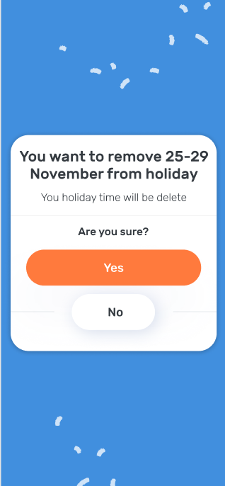
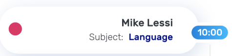

## ModalComponent
### HTML
```html
<gen-modal></gen-modal>
```
### Стили
>src/assets/styles/vars/modal.scss
* modal-weight: ширина модального окна
* modal-radius: border radius модального окна
* modal-background: цвет заднего фона для модального окна
* modal-padding: внутренние отступы модального окна 
## Содержит в себе
* кнопку из angular material, с цветом primary
* текст, передаваемый в объекте modal
* в интерфейсе modal присутствует поле img, будет браться из компонента, который будет генерировать эти картинки.
После реализации будет доработан компонент в этом плане
## Компонент
@Input() modal: Modal;
 
```ts
export interface Modal {
  text: string;
  success: boolean;
  img?: string;
}
```


## ConfirmModalComponent
### HTML
```html
<gen-confirm-modal></gen-confirm-modal>
```
### Стили
>src/assets/styles/vars/modal.scss
* modal-weight: ширина модального окна
* modal-radius: border radius модального окна
* modal-background: цвет заднего фона для модального окна
* modal-padding: внутренние отступы модального окна 
## Содержит в себе
* две кнопки из angular material: одна с цветом primary, другая без цвета 
* текст, описание - передаваемые в объекте modal
## Компонент
@Output() answer = new EventEmitter<boolean>(); <br>
@Input() modal: ConfirmModal;
 
```ts
export interface ConfirmModal {
  title: string;
  desc: string;
}
```


## ScheduleModalComponent
### HTML
```html
<gen-schedule-modal></gen-schedule-modal>
```
### Стили
>src/assets/styles/vars/modal.scss
* modal-radius: border radius модального окна
* modal-background: цвет заднего фона для модального окна
* modal-padding: внутренние отступы модального окна 
## Содержит в себе
* две кнопки из angular material: одна с цветом primary, другая без цвета neutral
* дату, передаваемый в объекте modal
* holiday - проверка на отображение модального окна 
(если true, то будет отображено модальное окно для add holiday) 
* datepicker - компонент из angular material
* иконки из собственного компонента с их генерацией
* два select из angular material (если holiday === false)
## Компонент
@Input() modal: ScheduleModal; <br>
form: FormGroup;
 
```ts
export interface ScheduleModal {
  date: string;
  holiday: boolean;
}
```


## ValidationAlertComponent
### HTML
```html
<gen-validation-alert></gen-validation-alert>
```
## Содержит в себе
* иконку из нашего компонента
* текст из сервиса
## Компонент
text: string
aSub: Subscription - чтобы отписывать от сервиса, с которого мы будем получать данные об ошибке


## EmojiFeedbackComponent
### HTML
```html
<gen-emoji-feedback></gen-emoji-feedback>
```
### Стили
>src/assets/styles/vars/general.scss
* $accent-gradient: синий градиент 
>src/assets/styles/vars/emoji-feedback.scss
* $emoji-margin: внешние отступы для emoji-feedback
## Содержит в себе
* img из передаваемого объекта (берется из нашего компонента с картинками, возможно поменять в зависимости от реализации)   
* text из нашего компонента  
## Компонент
emoji: EmojiFeedback[];
 
```ts
export interface EmojiFeedback {
  img: string;
  text: string;
}
```


## PhotoButtonComponent
### HTML
```html
<gen-photo-button></gen-photo-button>
```
### Стили

## Содержит в себе

## Компонент
 


## ScheduleCardComponent
### HTML
```html
<gen-schedule-card></gen-schedule-card>
```
### Стили
>src/assets/styles/vars/general-card.scss
* $accent-color: синий цвет
>src/assets/styles/vars/schedule-card.scss
* $schedule-padding: внешние паддинги для schedule card 
## Содержит в себе
* dot из нашего компонента gen-dot 

## Компонент
card: ScheduleCard[];
 
```ts
export interface ScheduleCard {
  name: string;
  subject: string;
  date: string;
  freetime: boolean;
}
```


## LessonCardComponent
### HTML
```html
<gen-lesson-card></gen-lesson-card>
```
### Стили
>src/assets/styles/vars/lesson-card.scss
* green-color: зеленый цвет
* accent-gradient: синий градиент
* accent-color: синий цвет
>src/assets/styles/vars/lesson-card.scss
* $lesson-card-header-padding: паддинг для заголовка карточки
* $lesson-card-padding: паддинг для карточки
* $lesson-card-content-padding: паддинг для контента карточки

## Содержит в себе
* две кнопки:
1) cancel (angular material, color primary, corner-button Для изменения border-radius'a)
2) кнопка chat with children (angular material, color neutral, corner-button для изменение border-radius'a). Кнопка для открытия с иконкой чата (из нашего компонента будет браться картинка)

## Компонент
card: LessonCard;
 
```ts
export interface LessonCard {
  name: string;
  date: string;
  subject: string;
  summary: string;
}
```

