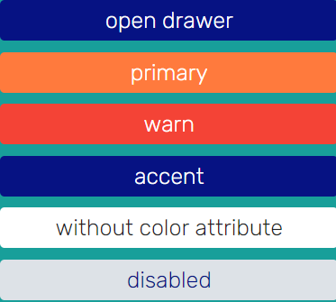

### ComponentsForProject
<h3>global: </h3>
<ul>
    <li>$inactive-color: #DDE2E7</li>
    <li>$gray-color: #c2c2c2</li>
    <li>$blue-gradient: linear-gradient(90deg, #2C83DA 0%, #4AB7F8 100%)</li>
    <li>$green-color: #67AC5B</li>
    <li>$border-radius: 30px</li>
    <li>$accent-color: дефолтный синий цвет</li>
</ul>

<h3>drawer: </h3>
<ul>
    <li>drawer-width: ширина drawer</li>
    <li>$drawer-hr-color: цвет для нижней линии</li>
    <li>$drawer-padding: padding для drawer</li>
    <li>$drawer-list-margin-bottom: margin bottom</li>
    <li>drawer-footer-li-margin: marin для footer > * li</li>
    <li>$drawer-hr-color: цвет обводки</li>
</ul>

<h3>global classes: </h3>
<ul>
    <li>.text__content - обычный размер текста</li>
    <li>.text__headline - размерз текста для загаловков</li>
    <li>.input - класс, для стилизации инпута</li>
    <li>.dot - разноцветные точки</li>
    <li>container-right - горизонтальный flex блок, который позиционирует текст по правой стороне </li>
    <li>.avatar - класс, для стилизации картинки с длиной и шириной 85px</li>
    <li>.card-blue - класс, для стилизации component’a с синим background’ом (homework-status component; feedback component)</li>
</ul>

<h3>card-student:</h3>
<ul>
    <li>$card-student-border-radius:  border-radius всей карточки</li>
    <li>$card-student-content-header-background: background header’а карточки</li>
    <li>$card-student-content-header-height: высота header’a</li>
    <li>$card-student-content-background: цвет для текста контента карточки</li>
    <li>$card-student-content-img-height: высота картинки карточки</li>
    <li>$card-student-content-img-width:  ширина картинки карточки</li>
    <li>card-student-content-padding-horizontal: горизонтальный паддинг для контента внутри карточки</li>
    <li>$card-student-content-icon-size: размер mat-icon</li>
</ul>

## Button
~~~html
<button mat-flat-button color="primary">primary</button>
<button mat-flat-button color="warn">warn</button>
<button mat-flat-button color="accent">accent</button>

<button mat-flat-button>without color attribute</button>
<button mat-flat-button disabled>disabled</button>
~~~

## Checkbox
~~~html
<mat-checkbox color="primary"></mat-checkbox>
<mat-checkbox color="primary"></mat-checkbox>
~~~

## Select
~~~html
<app-select [select]="select"></app-select>
~~~
~~~ts
interface ISelectOptions {
  value: string;
}

export interface ISelect {
  title: string;
  options: ISelectOptions[];
}
~~~

## Dot
~~~html

~~~
~~~ts
export type NamesColor = 'primary' | 'warn' | 'pink' | 'gradient' | 'accent' | 'green';

export interface IDot {
  name: NamesColor;
  color: string;
}
~~~

## Datepicker
~~~html
<app-datepicker></app-datepicker>
~~~

## Input
~~~html
<app-input [input]="input"></app-input>
<app-input [input]="inputNotRequired"></app-input>
~~~
~~~ts
export interface IInput {
  img: string;
  label: string;
  required: boolean;
}
~~~

## Feedback
~~~html
<app-feedback [feedbackInfo]="feedback"></app-feedback>
~~~
~~~ts
export interface IFeedback {
  emoji: string;
  text: string;
}
~~~

## Homework-status
~~~html
<app-homework-status [homeworkStatus]="homeworkStatus"></app-homework-status>
<app-homework-status [homeworkStatus]="homeWorkStatusFalse"></app-homework-status>
~~~
~~~ts
export interface IHomeWorkStatus {
  completed: boolean;
  date?: string;
}
~~~

## Notification
~~~html
<app-notification [notification]="notification"></app-notification>
~~~
~~~ts
export interface INotificationInfo {
  text: string;
  date: string;
}
~~~

## Confirm
~~~html
<app-confirm [confirm]="confirm"></app-confirm>
~~~
~~~ts
export interface IConfirm {
  title: string;
  desc: string;
}
~~~

## Modal
~~~html
<app-modal [modal]="modalSuccess"></app-modal>
<app-modal [modal]="modalDanger"></app-modal>
<app-modal [modal]="modalWOImg"></app-modal>
~~~
~~~ts
export interface IModal {
  img?: string;
  state?: string;
  text: string;
  success?: boolean;
}
~~~

## Card
~~~html
<app-card [card]="card"></app-card>
<app-card [card]="cardWOLastLesson"></app-card>
~~~
~~~ts
interface NextLesson {
  date: string;
  time: string;
}

export interface ICardInfo {
  img: string;
  lastLesson?: string;
  color: string;
  subject: string;
  name: string;
  nextLesson: NextLesson;
}
~~~

## Drawer
~~~html
<button
  (click)="createDrawer()"
  mat-flat-button
  color="accent"
>
  open drawer
</button>
<ng-template drawerRef></ng-template>
~~~
~~~ts
export interface TeacherInfo {
  firstName: string;
  lastName: string;
  img: string;
}

export interface MenuList {
  path: string;
  title: string;
}
~~~

